# Malmö Cycling Club

## Overview of project 

### Malmö cycling club is a website for people looking to connect with other cyclists in and around Malmö. The user can connect to the cycling club via social medias displayed, and sign up for the newsletter. The user can check out the different rides and events made by the cycling club, and can find information about the clubs café. 

The live website can be found here; [MalmoCC](https://jessicafransson.github.io/Malmo-cycling-club/)

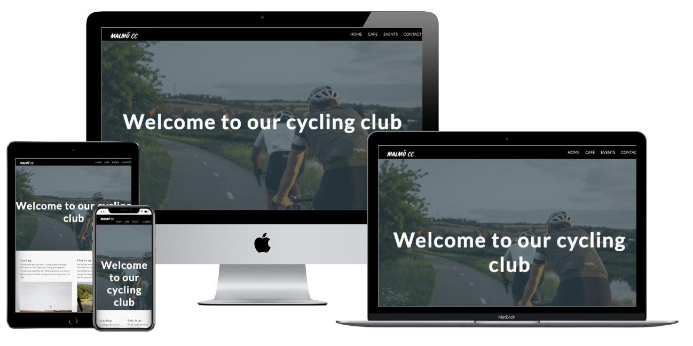

# UX

## About 

### As a user i want to:
- ### Learn about this cycling club
- ### Find information about their rides and events.
- ### Be able to get connected with them via the newsletter
- ### Find out how to connect with them on social media
- ### Access the website on both mobile and desktop
- ### See information about their café.

# Features

## Exsisting features

### Navigation:

- ### Featured on all pages.
- ### Navigation links at the top of the page to get to the different pages on the website without clicking "back"
- ### Clicking on the logo takes you to the home page

# Home page

## Header

- ### Intro about the website, explainatory text that we are a cycling club.

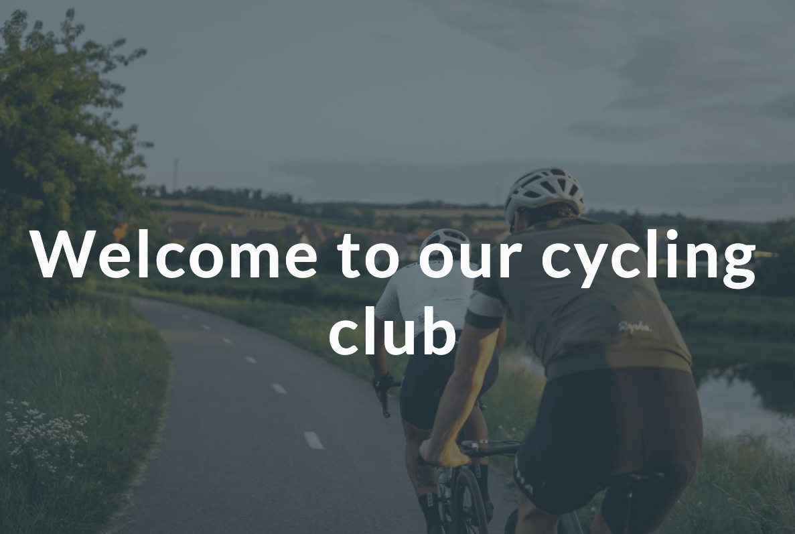

## Text field

- ### Column one tells the user who we are, and describes the love for cycling.

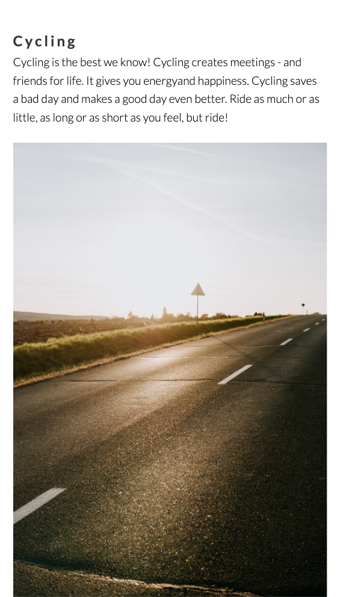

- ### Column two describes who we are, and our aim for malmö cyclists. 
- ### Features high quality images that shows roads and cyclists in a group.

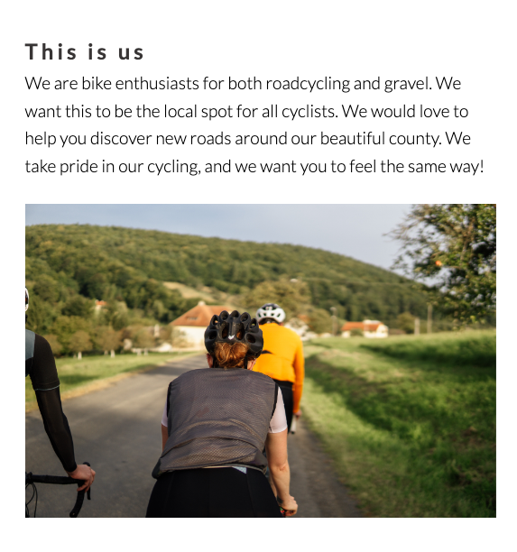

# Cafe page

## Header

- ### Header photo of coffee beans and a descriptive text

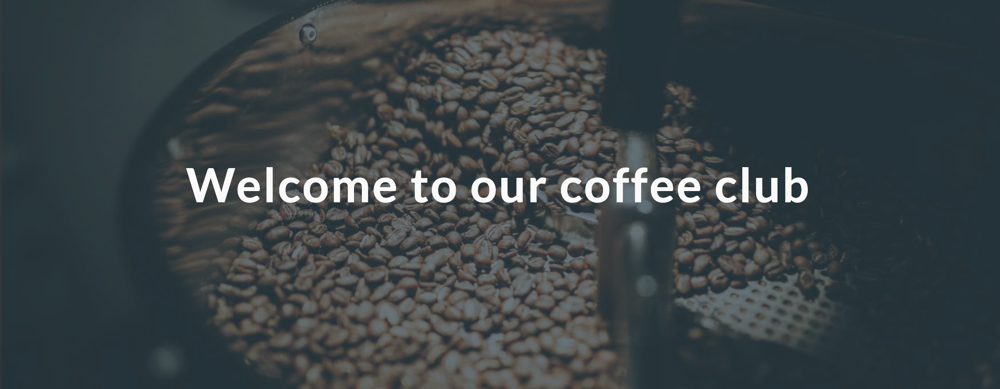

## Text information

- ### This section has some information about our passion for coffee in combination with our passion for cycling.
- ### There is also a high quality photo of a man making a latte.

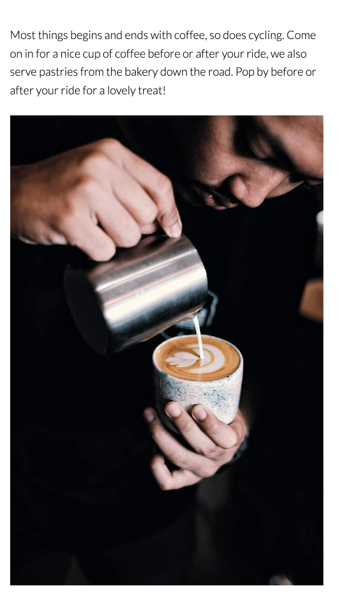

## Opening hours and menu

- ### This section shows the viewer we are open on these hours.
- ### The viewer can also see a selction from the menu.
- ### There's a high quality photo of two espressos being made.

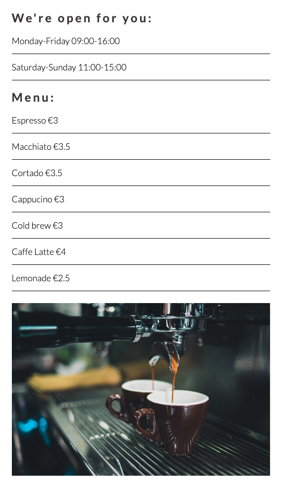

# Event page 

## Header 

- ### Header photo of a cyclist from behind with a descriptive text.

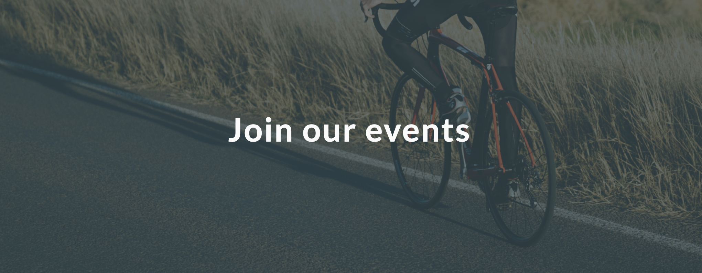

## Text information

- ### This text information describes what kind of rides we do.
- ### The viewer can also get information of weekdays and what kind of rides.
- ### The viewer will see a photo of 3 female cyclists chatting.

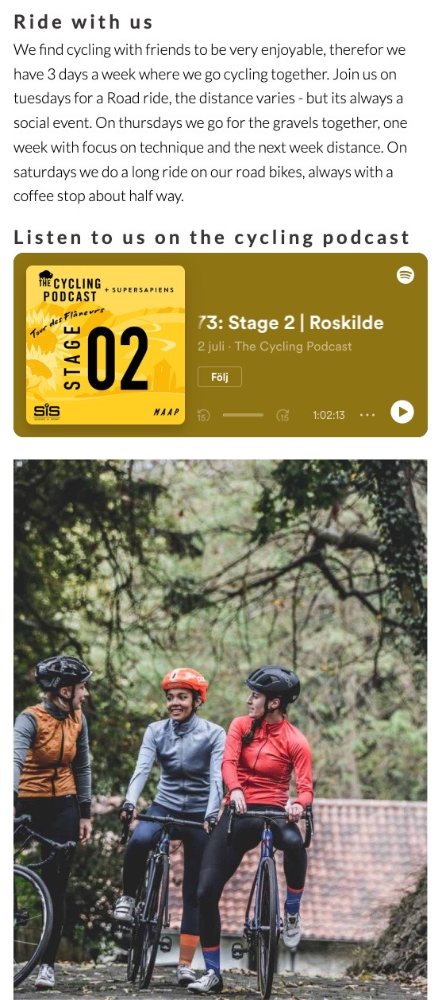

## Event information

- ### This list explains what events is on about Roadcycling.
- ### It shows the viewer about what dates and where to meet up.
- ### It also shows the events for gravel rides.
- ### It tells the viewer what dates and where to meet up.

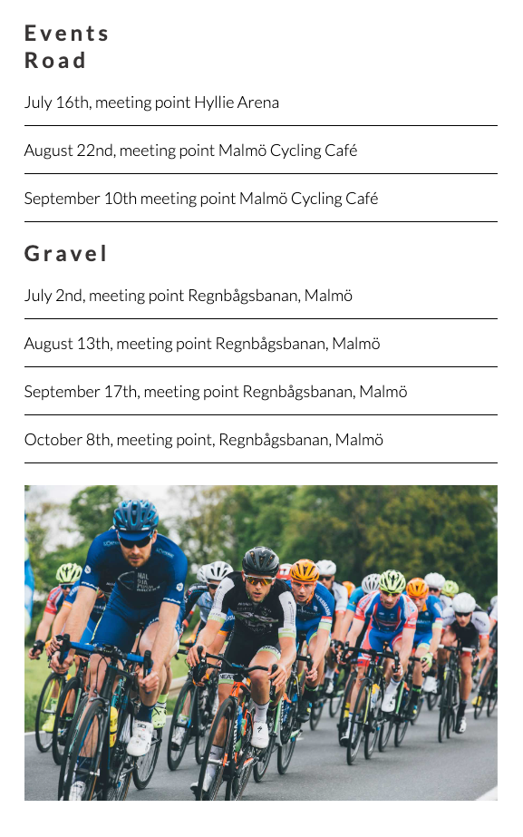

# Contact page 

## Header 

- ### Header photo and the text to keep in touch.

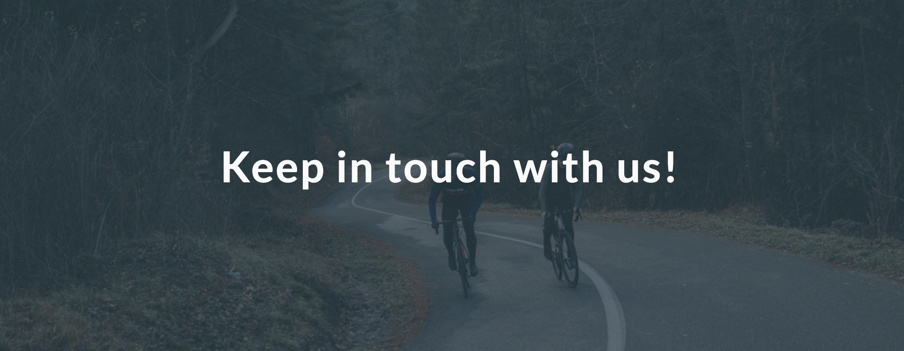

## Text information 

- ### This section of text tells the viewer to use their social media tags.
- ### This section tells the viewer to let them know of any tips/ideas to improve.
- ### This section tells the viewer to join the community.
- ### This section also have a picture of two bikes with a view over landscape.

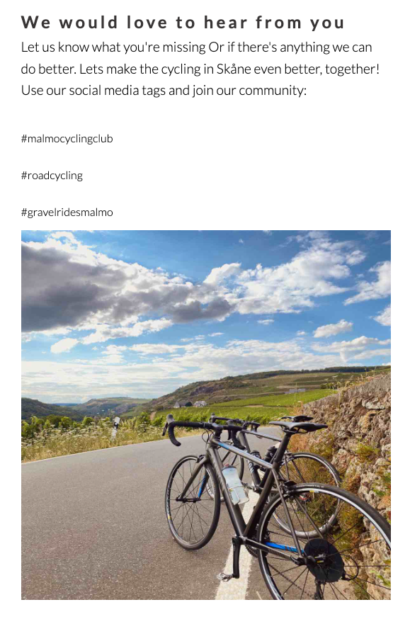

## Signup form

- ### This section tells the viewer to fill out information to subscribe to newsletter
- ### This section shows the viewer where to fill out information about suggestions/ideas of improvement.
- ### This section has a subscribe button

# Footer 

- ### The footer is sticking down the bottom of every page
- ### It shows the viewer what platforms they're active on
- ### It gives the viewer the option of opening the platforms in a new tab.
- ### It includes a text about checking them out on social media.
- ### At the end theres a text that describes who made the page, and with copyright.

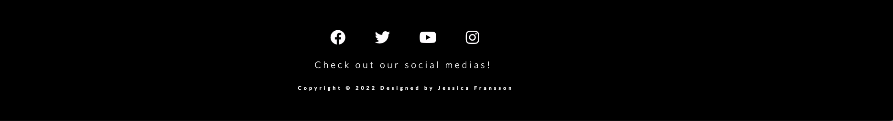

# Testing

## HTML
- ### Document has been checked and is completed. No errors or warnings to show.

## CSS 
- ### This document has been validated as CSS level 3 + SVG

## Accessibility 

- ### Colors have enough contrast and is easy to read

## Devices

- ### website has been tested on Macbook air, Iphone and Samsung S10+

## Desktop

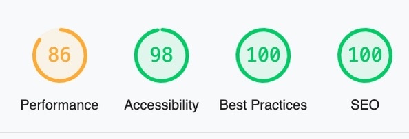

## Mobile

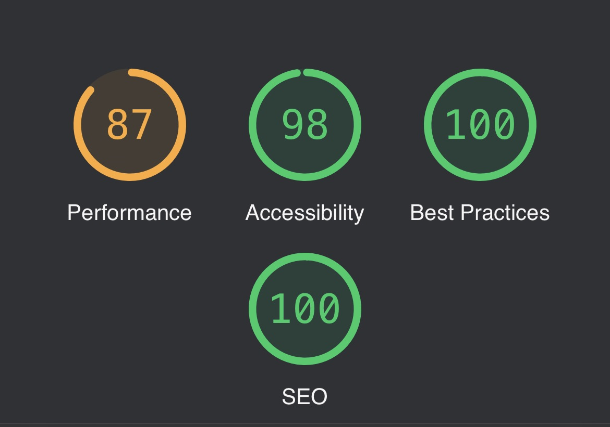

# Bugs and errors

## Solved
- ### When running the website thru accesibility i got a scoring of 70% due to size of images, i solved this by changing the sizes of all images in figma, and replacing them in gitpod.

## Unsolved
- ### No unsolved bugs.

# Deployment

## The site was deployed to GitHub Pages by doing the following steps:

- ### Click on the "Settings" tab in the Github repository for the project.
- ### Find, and click the "Pages" section on the left-hand menu bar.
- ### Under the "Source", select the "Branch:main" and hit save. 
- ### After a few minutes, the site should be deployed succesfully and the link will be found and can be clicked to lead to the website.

## Local Deployment

### To locally make a copy of this project on another computer follow these steps: 

- ### Locate the repository of the project you would like to copy.
- ### Click the "fork button" in the top right corner.
- ### When you navigate to your fork you will find the project and above the list of files you click "code"

# Future additions

## This is what i would add in the following steps to the website:

- ### Create routes to the events, and link them to the following platform to be displayed.
- ### Add a map of a fixed location where the cycling club and café would be located.
- ### Add a sign up form to the events for visitors to sign up.

# Credits

- ### Support and documentation in W3 Schools
- ### Icons from Font awesome (https://fontawesome.com/)
- ### Images edited in Figma
- ### Wireframe mockup made in Figma (https://www.figma.com/file/70WZYH1LUx3VQbB5DW9YJo/mockup-mcc)
- ### Favicon from favicon website (https://favicon.io/)
- ### Mockup from Techsini: (http://techsini.com/multi-mockup/index.php)
- ### Images from [Unsplash](https://unsplash.com/@dafidvor)