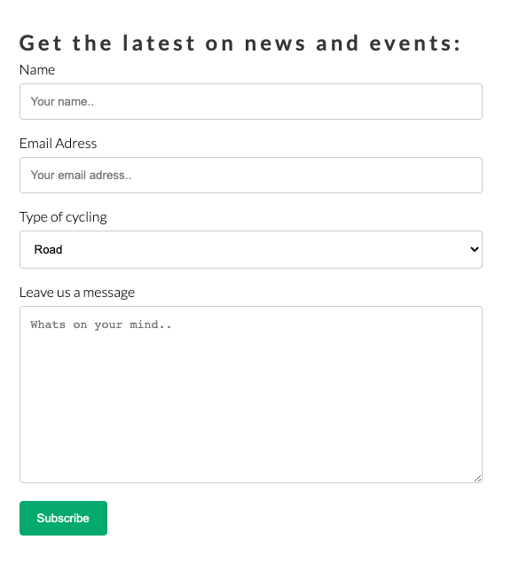

# Malmö Cycling Club

## Overview of project 

### Malmö cycling club is a website where you can get in touch with other cyclists in and around malmö. Participate in group rides and find information about upcoming events. There's also links to their social medias, and you can subscribe to their newsletter to not miss the latest information about the club and events. There's also a café connected to them and there's information about their opening hours and what they have to offer. 

The live website can be found here; [MalmoCC] (https://jessicafransson.github.io/project-one/)

# UX

## About 

### As a user i want to:
- ### Learn about this cycling club
- ### Find information about their events and rides
- ### Be able to get connected with them via the newsletter
- ### Find out how to connect with them on social media
- ### Access the website on both mobile and desktop

# Features

## Exsisting features

### Navigation:

- ### Featured on all pages.
- ### Navigation links at the top of the page to get to the different pages on the website without clicking "back"
- ### Clicking on the logo takes you to the home page

# Home page

## Header

- ### Intro about the website, explainatory text that we are a cycling club.

## Text field

- ### Column one tells the user who we are, and describes the love for cycling.

- ### Column two describes who we are, and our aim for malmö cyclists. 
- ### Features high quality images that shows roads and cyclists in a group.

# Cafe page

## Header

- ### Header photo of coffee beans and a descriptive text

## Text information

- ### This section has some information about our passion for coffee in combination with our passion for cycling.
- ### There is also a high quality photo of a man making a latte.

## Opening hours and menu

- ### This section shows the viewer we are open on these hours.
- ### The viewer can also see a selction from the menu.
- ### There's a high quality photo of two espressos being made.

# Event page 

## Header 

- ### Header photo of a cyclist from behind with a descriptive text.

## Text information

- ### This text information describes what kind of rides we do.
- ### The viewer can also get information of weekdays and what kind of rides.
- ### The viewer will see a photo of 3 female cyclists chatting.

## Event information

- ### This list explains what events is on about Roadcycling.
- ### It shows the viewer about what dates and where to meet up.
- ### It also shows the events for gravel rides.
- ### It tells the viewer what dates and where to meet up.

# Contact page 

## Header 

- ### Header photo and the text to keep in touch.

## Text information 

- ### This section of text tells the viewer to use their social media tags.
- ### This section tells the viewer to let them know of any tips/ideas to improve.
- ### This section tells the viewer to join the community.
- ### This section also have a picture of two bikes with a view over landscape.

## Signup form

- ### This section tells the viewer to fill out information to subscribe to newsletter
- ### This section shows the viewer where to fill out information about suggestions/ideas of improvement.
- ### This section has a subscribe button

# Footer 

- ### The footer is sticking down the bottom of every page
- ### It shows the viewer what platforms they're active on
- ### It gives the viewer the option of opening the platforms in a new tab.
- ### It includes a text about checking them out on social media.
- ### At the end theres a text that describes who made the page, and with copyright.

# Testing

## HTML
- ### Document has been checked and is completed. No errors or warnings to show.

## CSS 
- ### This document has been validated as CSS level 3 + SVG

## Accessibility 

- ### Colors have enough contrast and is easy to read

## Desktop

## Mobile

# Deployment

## The site was deployed to GitHub Pages by doing the following steps:

- ### Click on the "Settings" tab in the Github repository for the project.
- ### Find, and click the "Pages" section on the left-hand menu bar.
- ### Under the "Source", select the "Branch:main" and hit save. 
- ### After a few minutes, the site should be deployed succesfully and the link will be found and can be clicked to lead to the website.

## Local Deployment

# Credits

- ### Support and documentation in W3 Schools
- ### Icons from Font awesome 
- ### Images from Unsplash and photografer David
- ### Images edited in Figma
- ### Mockup made in figma
- ### Favicon from favicon website

Favicon from https://www.favicon.cc/?action=icon&file_id=862100
mockup from here: http://techsini.com/multi-mockup/index.php
images from unsplash credit David Dvoracek: https://unsplash.com/@dafidvor
mockup from figma of project: https://www.figma.com/file/70WZYH1LUx3VQbB5DW9YJo/mockup-mcc